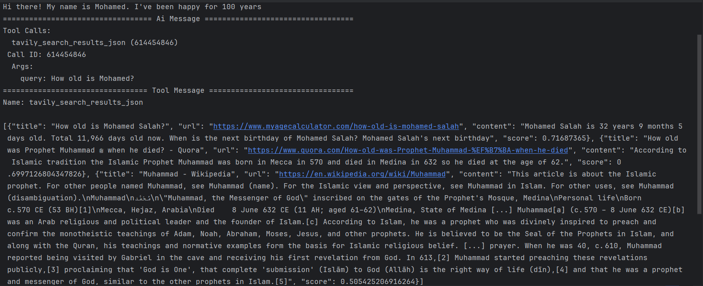

# Search Enhanced AI Chat with LangGraph

## Overview

This project is a graph-based AI chatbot that integrates search capabilities using LangGraph and Tavily Search tools. By leveraging state management, tool nodes, and checkpoints, the bot can dynamically handle user queries, perform searches, and manage conversation history. The design enables seamless routing between standard AI interactions and tool-assisted operations like web searches.



## Features

- **Graph-Based State Management**: Powered by LangGraph, the bot follows a structured flow with defined nodes and conditional routes.
- **Tool Integration**: Includes Tavily Search, allowing real-time search results based on user queries.
- **Dynamic Conversation Flow**: The bot switches between regular chat and tool usage when needed, enhancing its utility.
- **Checkpointing with SQLite**: Saves conversation states for smooth recovery and progress tracking.

## How It Works

1. **Environment Setup**: Loads API keys and configurations from environment variables.
2. **State Graph Initialization**: Creates nodes and sets conditions to manage the conversation flow.
3. **Tool Binding**: Connects the Tavily search tool to the chatbot, enabling search-based responses.
4. **Conversation Handling**: Processes user inputs, uses search when necessary, and maintains chat history.
5. **State Saving and Recovery**: Stores chat snapshots using SQLite checkpoints.

## Requirements

- Python 3.x
- LangGraph, LangChain, Tavily Search API, and other dependencies listed in the `requirements.txt` file.
- `.env` file with the necessary API keys (e.g., Tavily API key).

## Installation

1. Clone the repository:
   ```
   git clone <repo_url>
   cd <repo_directory>
   ```  
2. Install dependencies:
   ```
   pip install -r requirements.txt
   ```  
3. Set up the `.env` file with your API keys and other environment variables.

## Usage

1. Run the chatbot script to start the interactive AI chat.
2. Provide user input, and the bot will respond, using search tools when applicable.
3. Review conversation snapshots and state recovery to track past interactions.

## Customization

- **Tool Configuration**: Modify tool settings like `max_results` to adjust search behavior.
- **Graph Nodes and Conditions**: Add or edit nodes in the LangGraph state to expand the bot's capabilities.
- **Models and APIs**: Update the model or base URLs to integrate different AI models or APIs.

## Potential Enhancements

- Adding more tool integrations (e.g., translation, summarization).
- Expanding state conditions for advanced conversational flows.
- Enhancing checkpoint management for persistent storage across sessions.

## License

This project is open-source and licensed under [LICENSE_NAME].

## Contributions

Contributions are welcome! If you'd like to enhance this project, please submit a pull request or open an issue.

## Acknowledgments

- **LangGraph** for state graph management.
- **LangChain Community** for tool integration support.
- **Tavily API** for enabling search functionality.  